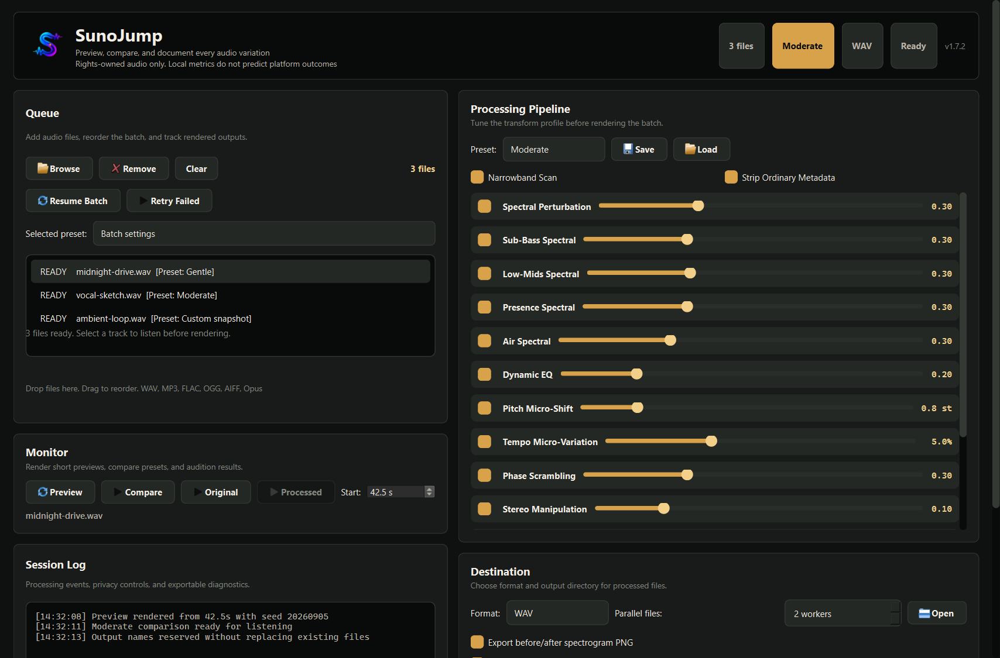
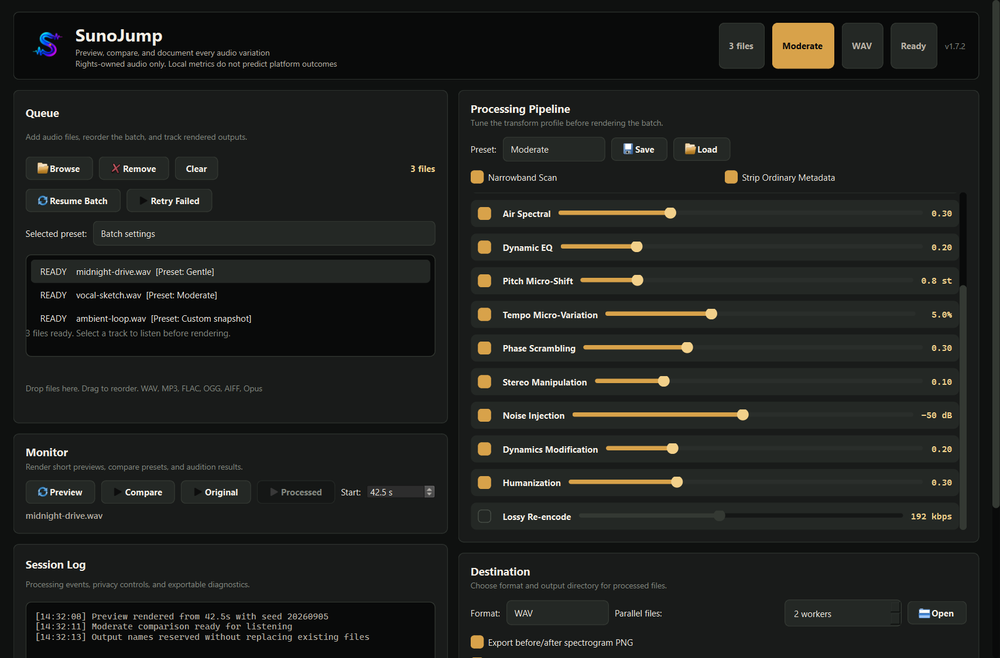
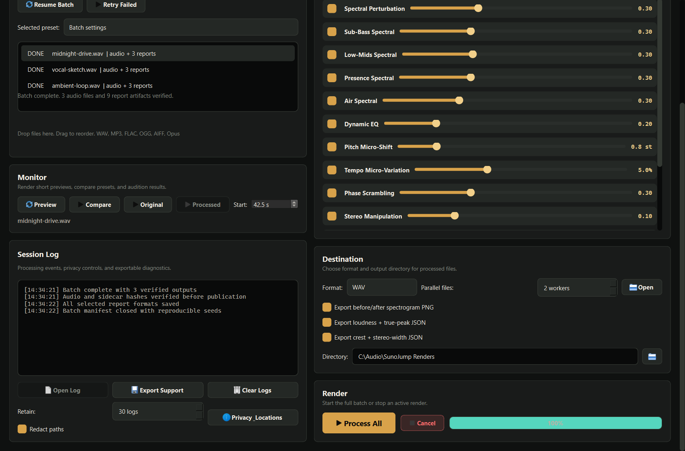
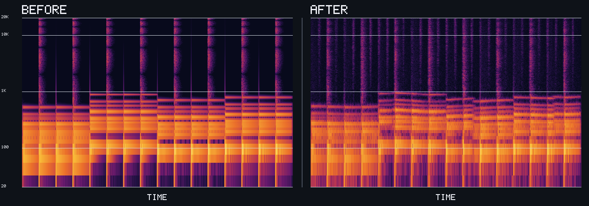

[](https://github.com/SysAdminDoc/SunoJump/releases/latest)
[](LICENSE)


# SunoJump

SunoJump is a private audio variation workstation for before-and-after listening and repeatable batch processing. Every result can keep its seed, hashes, sidecar, and selected analysis reports. Try a short sample first. Compare presets by ear. Commit to a full render only when it sounds right.

[Download the Windows app](https://github.com/SysAdminDoc/SunoJump/releases/latest) · [Run from source](#run-from-source) · [See the CLI](#command-line-workflows)



## Why use it

| When you need to... | SunoJump gives you... |
|---|---|
| Hear a change before processing a full track | Preview from any start time, then listen to the source and result inside the app |
| Choose settings by ear | One-click A/B listening across the built-in presets, with a saved winner for each file |
| Process a folder without losing your place | Parallel jobs, per-file presets, atomic output names, retry, and resumable manifests |
| Explain exactly what happened | Effective seeds, sidecars, file hashes, logs, and machine-readable JSON results |
| Inspect measurable differences | A matched-scale spectrogram plus optional loudness and signal-statistics reports |
| Keep masters private | Local processing with no account, telemetry service, upload step, or remote API |

SunoJump is built for careful experimentation. It never treats a changed waveform or local landmark score as proof of what another service will do.

## See the whole workflow

### Tune the full processing chain

The control surface keeps every enabled pass visible. Start with Gentle or Moderate, then adjust only what the track needs.



### Finish with evidence you can keep

Each successful output can include a replay sidecar and selected report files. Batch state is written as work progresses, so interrupted or failed jobs can be reconciled without replacing good output.



### Inspect before and after on one scale

This example came from the repository's deterministic CC0 synth fixture, processed by SunoJump v1.7.1 with the Moderate preset and seed `20260905`. Both panels use the same dBFS scale.



## The working loop

1. Add a track or folder. SunoJump validates the container before handing audio to the isolated decoder.
2. Pick a preset, adjust individual passes, or assign settings per file.
3. Render a short preview or compare all built-in presets from the same start time.
4. Process the queue. Outputs are reserved and published atomically without replacing an existing file.
5. Keep the sidecar, manifest, and any report artifacts with the audio when you need a repeatable record.

The pipeline can apply up to eleven stages: ordinary metadata handling, narrowband candidate scanning, spectral variation, dynamic EQ, coupled pitch and tempo changes, phase changes, stereo adjustment, shaped noise, dynamics, humanization, and an optional codec round trip.

## Responsible use and evidence limits

- Use SunoJump only with audio you own or are authorized to modify.
- Built-in metrics are experimental local measurements of the current input and output.
- A signal-change or landmark-overlap value does not predict or guarantee any platform, recognition, moderation, or detector outcome.
- SunoJump does not upload or resubmit audio, call platform APIs, or tune itself against a platform response.
- Source audio is never overwritten.

`sunojump.signal_change v1` is a normalized sample-domain difference. The optional `sunojump.constellation v1` result reports local landmark overlap as `measured`, `unavailable`, or `error`. Treat both as inspection aids, not acceptance scores.

## Install on Windows

1. Open the [latest release](https://github.com/SysAdminDoc/SunoJump/releases/latest).
2. Download `SunoJump.exe` and `SHA256SUMS`.
3. Verify the executable hash against the checksum file.
4. Run `SunoJump.exe`. No Python installation is required.

The Windows executable is not code-signed. Windows may show a SmartScreen notice. Download it only from this repository's Releases page and verify `SHA256SUMS` before running it.

SunoJump is portable. It stores settings and bounded diagnostic logs in the current user's application-data directory rather than installing a background service.

## Run from source

Python 3.11+ is required.

```bash
git clone https://github.com/SysAdminDoc/SunoJump.git
cd SunoJump
python -m venv .venv
```

Activate the environment, then install and launch:

```bash
python -m pip install -r requirements.txt
python sunojump.py
```

Source runs support Windows, macOS, and Linux. Preview playback depends on the codecs available to Qt Multimedia on the host. MP3 and M4A export require `ffmpeg` with the matching encoder.

## Command-line workflows

Process one file with a repeatable seed:

```bash
python sunojump.py -i song.wav -o ./renders -p moderate --seed 20260905
```

Process a directory and write every optional report:

```bash
python sunojump.py -i ./album -o ./renders -p gentle \
  --spectrogram --loudness-report --signal-report
```

Keep human diagnostics on stderr and write structured results to a file:

```bash
python sunojump.py -i ./album --result-format json > results.json
python sunojump.py -i ./album --result-format jsonl > results.jsonl
```

Compose a built-in preset with sparse JSON overrides:

```bash
python sunojump.py -i song.wav --profile ./gentle-tuned.json --pitch 0.75
```

Resume interrupted work or retry failed and partial jobs:

```bash
python sunojump.py --resume ./renders/SunoJump_Batch_....sunojump-batch.json
python sunojump.py --resume ./renders/SunoJump_Batch_....sunojump-batch.json --retry failed
```

Watch a folder for stable files:

```bash
python sunojump.py --watch ./incoming -p moderate
```

Watch mode waits for an unchanged size and modification time before accepting a file. Generated output goes to `incoming/output` by default, which prevents a render from feeding back into the watch directory.

Run `python sunojump.py --help` for the complete option reference.

## Presets and controls

The built-in presets describe transform amount only. They do not claim effectiveness against an external system.

- **Gentle** keeps changes restrained for listening-first work.
- **Moderate** is a balanced starting point and the CLI default.
- **Aggressive** applies stronger values across more of the pipeline.
- **Extreme** is the highest-intensity profile. Audition it carefully.
- **Custom** reflects your current per-pass settings.

Every numeric CLI override enables its matching pass. Use `--disable-pass PASS` when a pass must stay off. Preset files and profiles reject unknown keys, invalid types, non-finite numbers, future schemas, and values outside the documented range.

## Files created by a render

| File | Purpose |
|---|---|
| `track_sj.wav` | Validated audio output |
| `track_sj.sidecar.json` | Input and output hashes, effective seed, settings, dependency evidence, and replay notes |
| `SunoJump_Batch_....sunojump-batch.json` | Recoverable per-job state with attempts and artifact hashes |
| `track_sj.spectrogram.png` | Optional matched-scale before-and-after spectrogram |
| `track_sj.loudness.json` | Optional ITU-R BS.1770-5 loudness and true-peak comparison |
| `track_sj.signal.json` | Optional crest-factor, stereo-width, and correlation comparison |

JSON and JSON Lines CLI output report `succeeded`, `partial`, `failed`, or `cancelled` with stable error codes. A report failure never turns a usable audio render into a false success, and an all-success batch is the only state that reaches 100 percent.

## Audio and format support

**Input:** WAV, MP3, FLAC, OGG, AIFF, Opus

**Output:** WAV, FLAC, OGG, MP3, M4A

Before decoding, SunoJump checks the extension, container signature, duration, sample rate, channel count, file size, and estimated decoded memory. IRCAM and WAV IMA ADPCM payloads are rejected at the containment boundary. Large inputs use disk-backed maps and bounded processing chunks.

## Privacy, diagnostics, and provenance

Processing stays on the machine. No account or network service is used. Diagnostic paths are redacted by default, retention is adjustable, and the support ZIP excludes audio, manifests, replay sidecars, and settings contents.

SunoJump performs bounded discovery of C2PA Content Credentials before decode. A detected manifest is blocked by default. Continuing requires an explicit acknowledgement that the transformed output will omit and will not re-sign the source credentials. The original remains unchanged. Discovery does not validate signatures or trust chains.

## Build and verify a release

Windows release builds use CPython 3.12 and hash-pinned wheels:

```bash
python -m pip install -r requirements-dev.txt
python tools/audit_dependencies.py
python tools/audit_licenses.py
python tools/generate_brand_assets.py
python tools/build_release.py
```

`tools/build_release.py` creates a fresh temporary environment, installs only the hashed runtime and build inputs, builds without UPX, and exercises the new executable through its version, help, fixture-render, and GUI paths. The GUI smoke check runs on a private Windows desktop and never takes over the active screen. The final `dist/` directory contains:

- `SunoJump.exe`
- `SHA256SUMS`
- a CycloneDX 1.7 SBOM
- build provenance and the actual frozen-package inventory
- native version evidence and the compatibility baseline
- license notices, source routing, both lock files, and the matching source archive

The release build is intentionally unsigned and records that fact in its provenance. Run the complete source test suite offscreen on Windows with host fonts available:

```powershell
$env:QT_QPA_PLATFORM = 'offscreen'
$env:QT_QPA_FONTDIR = "$env:WINDIR\Fonts"
python -m pytest -q
```

Capture the current marketing images without touching saved app settings:

```bash
python tools/capture_screenshot.py docs/screenshots/workspace.png --width 1366 --height 900 --scene workspace
python tools/capture_screenshot.py docs/screenshots/pipeline.png --width 1366 --height 900 --scene pipeline
python tools/capture_screenshot.py docs/screenshots/evidence.png --width 1366 --height 900 --scene evidence
```

## License

SunoJump source code is available under the [MIT License](LICENSE).

The packaged Windows executable bundles PyQt6 under GPL-3.0 and LGPL-licensed Qt components. The release therefore includes the corresponding source route, notices, dependency inventory, SBOM, and matching application source archive. Review `THIRD_PARTY_NOTICES.txt` and `SOURCE_ROUTING.txt` beside the executable before redistributing the binary.
