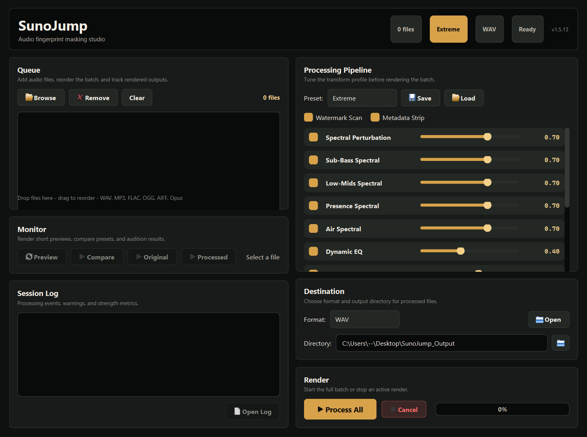

<br>


# SunoJump

Audio fingerprint masking tool. Transforms audio files through a multi-pass processing pipeline to alter their acoustic fingerprint while preserving audible quality. Designed for creators who need to re-upload their own Suno-generated music as templates when detection systems produce false positives.




## How It Works

SunoJump applies an 11-pass processing pipeline with **non-uniform segment-based transforms** — each segment of the audio gets slightly different processing parameters, breaking the constellation patterns that fingerprinting systems rely on.

### Processing Pipeline

| # | Pass | What It Does |
|---|------|-------------|
| 1 | **Metadata Strip** | Removes all embedded tags, IDs, and hidden metadata |
| 2 | **Spectral Perturbation** | Scans candidate watermark bands, then perturbs frequency magnitudes with per-band controls and randomized STFT window sweeps |
| 3 | **Dynamic EQ** | Time-varying multiband EQ with LUFS-like gain matching |
| 4 | **Pitch Micro-Shift** | Non-uniform pitch warping across random segments |
| 5 | **Tempo Micro-Variation** | Coupled in-segment timing drift that keeps segment boundaries beat-aligned |
| 6 | **Phase Scrambling** | Randomizes phase relationships in STFT domain |
| 7 | **Stereo Manipulation** | Mid-side processing to alter stereo field |
| 8 | **Noise Injection** | Adds masking-aware shaped pink noise below local spectral thresholds |
| 9 | **Dynamics Modification** | Per-frame random gain variation to break statistical patterns |
| 10 | **Humanization** | Wow/flutter, dynamic breathing, micro noise floor |
| 11 | **Lossy Re-encode** | MP3 encode/decode cycle to degrade fine watermark detail (requires ffmpeg) |

### Key Differentiator: Non-Uniform Processing

Unlike tools that apply flat transforms across the entire track, SunoJump splits audio into variable-length segments and applies **different transform parameters to each segment**. This breaks the relative timing and frequency relationships between spectral peaks — the exact features that constellation-based fingerprinting depends on.

## Installation

### Windows (recommended) -- prebuilt executable
Download `SunoJump.exe` from the [latest release](https://github.com/SysAdminDoc/SunoJump/releases/latest). No Python install required. Double-click to launch.

### From source (any platform)
```bash
git clone https://github.com/SysAdminDoc/SunoJump.git
cd SunoJump

# Install dependencies
python -m pip install -r requirements.txt

# Run
python sunojump.py
```

### Requirements
- Python 3.9+
- ffmpeg (optional, for Lossy Re-encode pass)
- PyQt6 Multimedia (optional, for in-app preview playback; usually bundled)

Install Python dependencies before running from source; the packaged executable already includes them.

### Release Dependency Audit
```bash
# Optional: install the release-verified dependency set
python -m pip install -r requirements-lock.txt

# Install local audit tooling, then scan the release lock
python -m pip install -r requirements-dev.txt
python tools/audit_dependencies.py
```

## Features

- **11-pass audio processing pipeline** — metadata strip, spectral perturbation, dynamic EQ, pitch/tempo micro-shift, phase scrambling, stereo manipulation, noise injection, dynamics, humanization, lossy re-encode
- **LUFS-preserving Dynamic EQ** — reshapes band energy without silently changing perceived loudness
- **Psychoacoustic noise shaping** — keeps injected pink noise lower in quiet regions and under louder spectral masks
- **Watermark-band scan pre-pass** — auto-detects stable narrowband candidates per file and targets them during spectral perturbation
- **STFT window sweeps** — varies 1024/2048/4096-point windows across randomized spectral segments
- **Per-band spectral controls** — tune sub-bass, low-mids, presence, and air perturbation independently
- **Coupled non-uniform pitch/tempo processing** — breaks constellation fingerprint patterns while keeping segment boundaries beat-aligned
- **4 built-in presets** — Gentle, Moderate, Aggressive, Extreme + Custom
- **Per-pass toggles and strength sliders** — fine-grained control
- **Render Preview** — hear a 30-second sample with your current settings before committing to full-file processing
- **Compare Presets** — one click renders a 20-second sample per preset so you can A/B/C/D audition all four, then apply your favorite
- **In-app A/B playback** — play original and processed side-by-side without leaving the app
- **Accessible GUI controls** — primary controls and pass sliders expose screen-reader names, descriptions, and a tested focus order
- **Explicit codec export** — WAV/FLAC/OGG export directly, with MP3/M4A export enabled when ffmpeg is available
- **Input preflight guardrails** — validates headers, size, sample rate, channels, and decoded memory cost before full-file decode
- **Atomic output saves** — writes final audio through same-folder temp files and promotes only completed artifacts
- **Persistent run diagnostics** — every GUI and CLI run writes a local log with environment, parameters, paths, pass results, and tracebacks
- **Detection-signature and constellation self-test logs** — reports heuristic AI-detection movement plus estimated landmark overlap remaining after processing
- **Reproducible output** — optional `--seed` for bit-identical runs (useful for testing and diffing)
- **Batch processing** — drag/drop multiple files, reorder them, process in parallel
- **Custom preset save/load** — export your tuned settings to JSON, share, or reuse
- **Chunked long-audio processing** — bounded memory for songs > 1 minute
- **Open Output** — one-click to output folder in your file manager
- **Modification strength metric** — know how much you've changed before uploading

## Usage

### GUI Mode
```bash
python sunojump.py
```

1. Drop audio files into the file list (or click Browse)
2. Select a preset or customize individual parameters
3. (Optional) Click **Render Preview** to process the first 30 seconds of the selected file so you can hear the result before committing; adjust settings and re-render as needed
4. Click **Process All** to render every file in the list to the output directory with `_sj` suffix

### CLI Mode
```bash
# Basic usage with preset
python sunojump.py -i song.wav -p aggressive

# Custom parameters
python sunojump.py -i song.wav --pitch 1.5 --phase 0.5 --spectral 0.4

# Batch process a directory
python sunojump.py -i ./my_songs/ -o ./output/ -p moderate -f flac

# With lossy re-encode
python sunojump.py -i song.wav -p aggressive --reencode 128
```

#### CLI Options
| Flag | Description | Default |
|------|-------------|---------|
| `-i, --input` | Input file or directory | (required) |
| `-o, --output` | Output directory | `~/Desktop/SunoJump_Output` |
| `-p, --preset` | gentle, moderate, aggressive, extreme | moderate |
| `-f, --format` | wav, flac, ogg, mp3, m4a (mp3/m4a require ffmpeg) | wav |
| `--preset-file` | Path to custom JSON preset (overrides `-p`) | none |
| `--no-watermark-scan` | Disable automatic watermark-band scan pre-pass | enabled |
| `--spectral` | Spectral perturbation (0.0-1.0) | preset |
| `--spectral-sub-bass` | Sub-bass spectral perturbation (0.0-1.0) | preset |
| `--spectral-low-mids` | Low-mids spectral perturbation (0.0-1.0) | preset |
| `--spectral-presence` | Presence-band spectral perturbation (0.0-1.0) | preset |
| `--spectral-air` | Air-band spectral perturbation (0.0-1.0) | preset |
| `--dynamic-eq` | Dynamic EQ amount (0.0-1.0) | preset |
| `--pitch` | Pitch micro-shift in semitones (0.0-5.0) | preset |
| `--tempo` | Tempo variation (0.0-0.15) | preset |
| `--phase` | Phase scrambling (0.0-1.0) | preset |
| `--stereo` | Stereo manipulation (0.0-0.5) | preset |
| `--noise` | Noise level in dB (-70 to -30) | preset |
| `--dynamics` | Dynamics amount (0.0-1.0) | preset |
| `--humanize` | Humanization amount (0.0-1.0) | preset |
| `--reencode` | Lossy re-encode bitrate (96-320) | disabled |
| `--seed` | Integer for deterministic random generator (same seed = same output) | random |

Use `Save...` in the GUI to export the current settings, then pass the resulting `.json` to `--preset-file` on the CLI to reproduce the same configuration across runs.

## Presets

| Preset | Pitch | Spectral | Phase | Noise | Use Case |
|--------|-------|----------|-------|-------|----------|
| **Gentle** | 0.3 st | 0.10 | 0.10 | -60 dB | Minimal change, preserve quality |
| **Moderate** | 0.8 st | 0.30 | 0.30 | -50 dB | Good balance of masking vs quality |
| **Aggressive** | 1.5 st | 0.50 | 0.50 | -45 dB | Strong masking, slight quality trade-off |
| **Extreme (default, recommended)** | 3.0 st | 0.70 | 0.70 | -40 dB | Highest bypass success rate -- tested and confirmed |

> **Recommendation:** Start with **Extreme**. Real-world testing against Suno's detection has shown it to deliver the most consistent bypass results. The lighter presets are included for cases where audio fidelity is the priority, but for re-uploading your own songs as templates, Extreme is the proven winner.

## Modification Strength

After processing, SunoJump reports a **modification strength** percentage:

- **0-25%** — Light: may not be sufficient for detection bypass
- **25-50%** — Moderate: likely effective
- **50-75%** — Strong: highly likely effective
- **75-100%** — Extreme: verify audio quality hasn't degraded too much

Start with the default **Extreme** preset -- field-tested as the most reliable for bypassing Suno's detection.

## Supported Formats

**Input:** WAV, MP3, FLAC, OGG, AIFF, Opus

**Output:** WAV (24-bit), FLAC, OGG Vorbis, MP3, M4A/AAC

## Release Licensing

SunoJump's own source code is MIT-licensed. Runtime dependencies include copyleft-licensed packages:

| Package | License | Notes |
|---------|---------|-------|
| PyQt6 | GPL-3.0-only | GUI toolkit; users install via pip |
| mutagen | GPL-2.0-or-later | Metadata tag library; users install via pip |
| PyQt6-Qt6 | LGPL-3.0 | Qt runtime; dynamically linked |

**Source installs:** users install dependencies themselves via `pip install -r requirements.txt`. SunoJump source is MIT.

**Binary releases (PyInstaller):** the combined executable bundles GPL-licensed components. The binary as a whole must comply with GPL-3.0 terms. Source code is always available in this repository.

Run `python tools/audit_licenses.py` to verify the license inventory for all release dependencies. The audit gate blocks release packaging when unreviewed licenses appear.

## License

MIT
